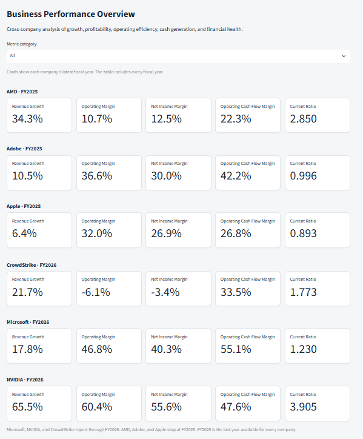

# Business Performance Analytics

Interactive review of operating performance for six technology companies: Microsoft, Apple, NVIDIA, Adobe, AMD, and CrowdStrike.

The project compares growth, profitability, operating efficiency, cash generation, and financial health, and flags items that may warrant management attention. The numbers come from SEC annual filings, prepared in Python and calculated with SQL. It is not a trading or investment tool.

## Source

Annual Form 10-K facts from the [SEC Company Facts API](https://data.sec.gov/api/xbrl/companyfacts/), fiscal years 2021 onward. Each company keeps its own fiscal year. Microsoft, NVIDIA, and CrowdStrike report through FY2026. AMD, Adobe, and Apple stop at FY2025. FY2025 is the last year available for every company.

Databricks SQL views calculate the metrics: `growth_trend`, `performance`, `financial_health`, `peer_benchmarking`, and `executive_summary`. The Streamlit app reads those views when Databricks credentials are set. Otherwise it rebuilds the same metrics from `data/processed/company_financials_wide.csv`.

## Run the app

From this folder:

```powershell
py -m pip install -r requirements.txt
py -m streamlit run app.py
```

If `py` is not recognized, use `python` in both commands. Open the local URL Streamlit prints, usually http://localhost:8501.

## Overview



The picture is Overview for all six companies. Each company has its own row, and every number on that row is visible. The year on the row is that company's latest fiscal year.
